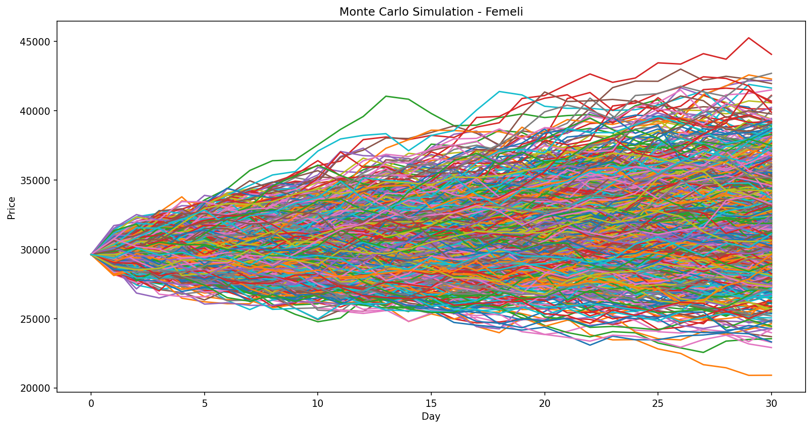
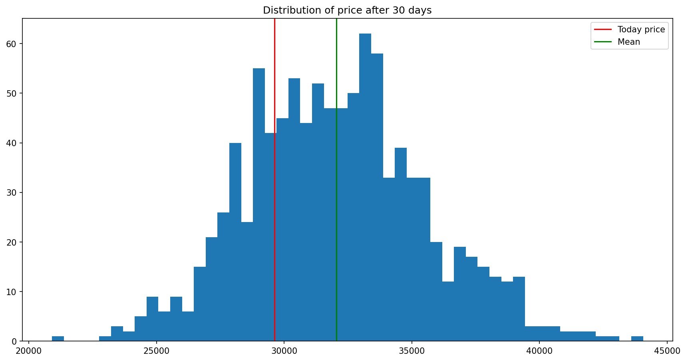

# Monte Carlo Simulation for Stock Price Forecasting

A Monte Carlo simulation of the **Femeli** stock (Tehran Stock Exchange) over the **next 30 trading days**, using **Geometric Brownian Motion (GBM)**. The project estimates a range of possible future prices and the probability of loss, rather than a single-point forecast.

## Method

1. Download adjusted daily closing prices of Femeli (1400-01-01 to 1405-07-14) with the [finpy-tse](https://github.com/ali-nsd/finpy-tse) library.
2. Compute daily log returns and estimate their mean ($\mu$) and standard deviation ($\sigma$).
3. Simulate 1,000 price paths for 30 trading days, where each day's price is:

$$S_t = S_{t-1} \cdot e^{\left(\mu - \frac{1}{2}\sigma^2\right) + \sigma Z_t}, \qquad Z_t \sim N(0, 1)$$

4. Summarize the distribution of the day-30 prices: mean, median, 90% interval, expected return, and loss probability.

## Results





| Metric | Value |
|---|---|
| Mean final price | ~32,050 |
| Median final price | ~31,950 |
| 5th percentile | ~26,750 |
| 95th percentile | ~38,200 |
| Expected return | ~8.2% |
| Probability of loss | ~25% |

**Key takeaways:**
- Roughly 90% of simulated paths end between about -10% and +29% relative to today's price.
- About 1 in 4 paths ends below today's price.
- The upside range is wider than the downside range, a typical property of multiplicative price models.

## Limitations

- Assumes normally distributed returns and constant volatility.
- The positive drift reflects high nominal growth in recent years (inflation-driven) and may not repeat.
- Price limits, trading halts, and sudden shocks in the Tehran market are not modeled.
- The results describe a possible scenario based on historical behavior, not a guaranteed forecast.

## Files

| File | Description |
|---|---|
| `monte_carlo_femeli.ipynb` | Main notebook with code and analysis |
| `femeli_prices.csv` | Historical adjusted prices used in the simulation |
| `simulation_paths.png` | Plot of the 1,000 simulated paths |
| `final_price_distribution.png` | Histogram of day-30 prices |

## How to Run

```bash
pip install numpy pandas matplotlib scipy finpy-tse jupyter
jupyter notebook monte_carlo_femeli.ipynb
```

The random seed is fixed (`np.random.seed(42)`), so results are reproducible.

## Tools

Python, NumPy, pandas, SciPy, Matplotlib, finpy-tse, Jupyter
